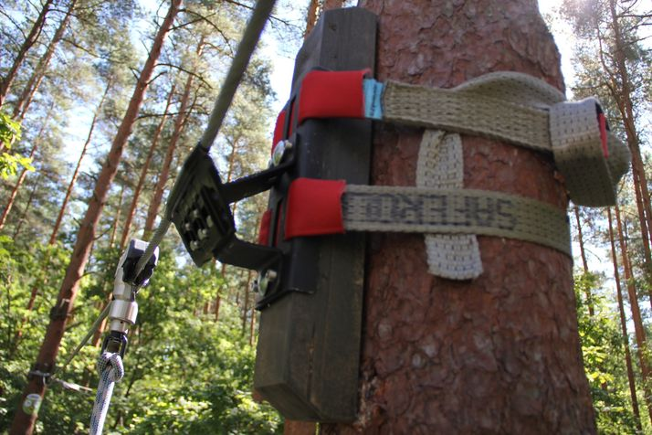

# Hardware

## Microphones

| Make&Model	    |	Type |		Freq            	|	Sensitivity		|	Price	|	Notes | Comments |
| -----------    |------   |--------        |--------------|-------|-------|----------|
|	RØDE smartLav+	| omni    |	60Hz - 18kHz	  | -35 dB	      | $100	| Powered from iPhone TRRS socket (2.7V). lavalier style.| The Borneo guys use the RODE. Gets well rated in reviews.| 
|	Polsen MO-PL1	 | Omni    | 	50Hz - 18 KHz	| -54 dB 	     | $45	US price | lavalier| Cheap, but doesn't rate great on sensitivity.|
|	Amazon Basics  | Desktop Mini Microphone	 | 50 Hz – 18KHz| -35 dB	| $70	| With stand| Built for podcasting but gets good reviews. |
|	Movo PM10      | 	omni	  | 35 Hz - 18 kHz	| -30 dB 	     | $34| 	Amazon ships in from US. Lavalier.| Cheap and good sensitivity. Ships from US Amazon.|
|	Clippy EM272 Mono	| omni	|60 Hz - 18 KHz	 | -28 dB	      | $30	| From UK. FEL Communications. Needs TRS to TRRS Microphone Adapter. The DIY option.| This is the DIY option. Highly recommended by guys doing natural history recordings. Maybe down the line when we need a number of cheap but excellent microphones we go this route.|

## Accessories

 Extension cord for lavalier microphone:  eg. Rode SC1 TRRS Extension Cable for SmartLav+ Microphone, 20 Feet 
 (this might allow the microphone to be situated independent of the other devices. Run the extension down tree.)
 
 ## DIY microphones
 
 [Building a quality USB-C microphone](https://www.youtube.com/watch?v=LoQu3XXIayc)
 
 https://www.wildmountainechoes.com/equipment/diy-stereo-electret-mics-primo-em-172-capsules/
 
 
## Tree Mount and Straps
 
 VOLT® Tree Strap Mounting Kit Brass. Ratcheting strap mounting kit for fast and secure fixture mounting in trees
 
https://www.voltlighting.com/tree-strap-mounting-kit-brass

Slackers Build a Branch

 https://b4adventure.com/products/slackers-build-a-branch-swing-tree-backyard-adventure-kids-outdoor-toy
 
Saferoller tree clamp

https://www.kanopeo.com/en/continuous-belay-system/saferoller/products/5-treeclamp.php

[I like this setup]

## Access Point notes

We need a device that can work as a wireless access point. Ideally we can flush
the firmware so that we can install a custom linux firmware.

There are several linux-based systems tat we could use: Tomato-RT, DD-wrt,
OpenWrt. OpenWrt seems to be the most flexible, and therefore it's the system
we are using.

We need to use hardware that is compatible with OpenWrt (supported chip, enough
flash memory, etc) and that has the capability to accept external storage (via
USB, Compact Flash, etc.).

We have used the NetgearN600 Wireless Router. I has to be Model WNDR3700 v1 or
v2; all other models seem to be unsupported.

This seems to be a reliable and powerful model: Atheros AR7161 680 MHz MIPS
32-bit processor, 8 MB flash and 64 MB RAM. Wi-Fi specs include a 2.4 GHz
Atheros AR9223 2x2 MIMO radio and a 5 GHz Atheros AR9220 2x2 MIMO radio.

Other supported models are:
 * Linksys WRT54GL
 * TP-Link TL-WR1043ND

## Battery-powered

These can be run with a 5V/USB Battery

TP-Link TL-WR703N
400Mhz
4 MB flash memory
32 MB RAM

TP-Link MR3020
400MHz
4 MB flash memory
32 MB RAM

We have v1 of this model. Installed
http://downloads.openwrt.org/attitude_adjustment/12.09-rc1/ar71xx/generic/openwrt-ar71xx-generic-tl-mr3020-v1-squashfs-factory.bin

Raspberry Pi
700 MHz
512 MB

